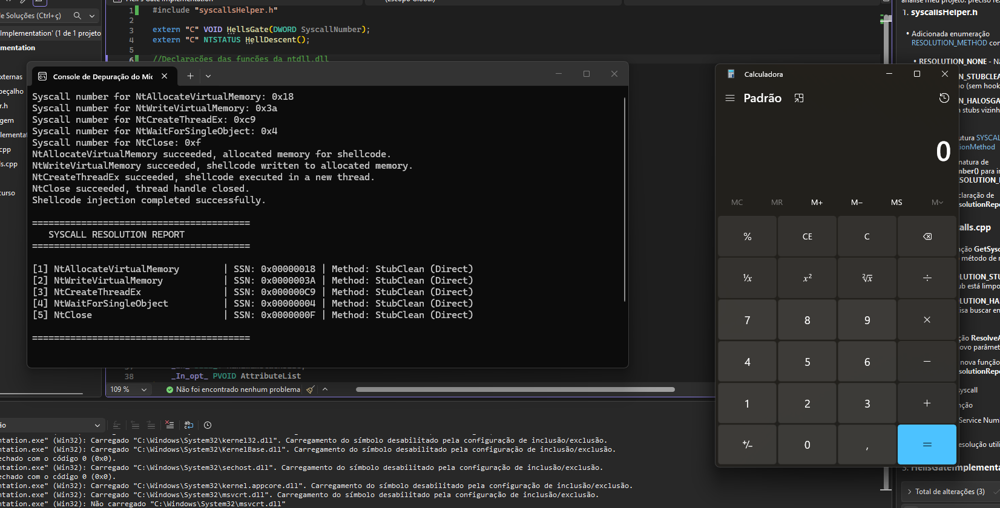

# MyHellsGateImplementation
Minha implementação da técnica Hell's Gate + Halo's Gate + PEBWalking para recuperar SSN's de funções da ntdll.dll.


## Authores da técnica

- [@am0nsec](https://www.github.com/am0nsec)
- @smelly__vx


## Sobre a técnica

A ténica Hell's Gate, consiste basicamente em recuperar dinamicaente o SSN (Syscall Numbers) de funções Nt diretamente na memória do módulo ntdll.dll, passando eles para um stub assembly que executará as funções Nt bypassando hooks de usuário através de Direct Syscalls. 

O Halo's Gate é uma melhoria da técnica Hell's Gate. Caso um stub esteja hookado, a técnica permite recuperar o SSN de uma função específica através de um cálculo de distância a partir de stubs não hookados vizinhos.

Estas técnicas evitam o uso das funções GetModuleHandle e GetProcAddress. Para elas não aparecerem na IAT, é realizado um PEBWalking para recuperar o módulo ntdll.dll e as funções Nt manualmente.
## Estrutura do projeto

Dentre os arquivos presentes no repositório, os códigos estão estruturados dessa maneira:

```text
HellsGateImplmentation
    ├── peb_walking.cpp 
    ├── syscallsHelper.h 
    ├── resolveSyscalls.cpp 
    ├── stub.asm
    └── HellsGateImplementation.cpp 
```

No arquivo peb_walking.cpp, está a implementação de duas funções, a GetProcAddressPeb e GetModuleHandlePeb. A primeira, procura o módulo ntdll.dll e a segunda procura as funções dentro desse módulo.

No arquivo syscallsHelper.h, está a definição de todas as funções e macros que são utilizadas nos demais arquivos

No arquivo resolveSyscalls.cpp, está a implementação das funções que verificam se o stub está limpo, que recuperam os SSNs e que populam a struct das syscalls.

No arquivo stub.asm está o stub assembly que será usado para executar as funções Nt via Direct Syscalls.

E no arquivo HellsGateImplementation.cpp estão as declarações das funções Nt e é neste arquivo onde as funções dos arquivos anteriores são chamadas. As funções Nt utilizadas executam uma injeção de código (shellcode) no próprio processo (GetCurrentProcess( ) ) clássica. (NtAllocateVirtualMemory + NtWriteVirtualMemory + NtCreateThreadEx + NtWaitForSingleObject + NtClose)


## POC



## Link do meu blog:

https://kittens-den.gitbook.io/kittens-den
